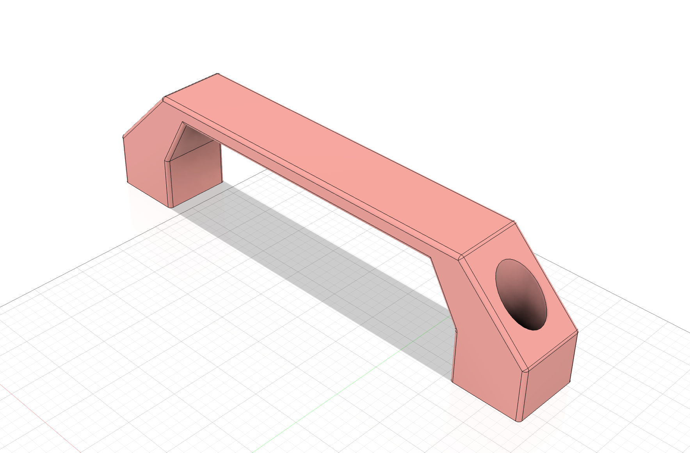

{:class="img-fluid w-100"}

1. Create a new file named `handle` in Fusion 360

1. Create a new sketch on the XY plane, named `handle_base`

    {:class="img-fluid w-100"}

1. Extrude the body profile by `20mm`:

    {:class="img-fluid w-100"}

1. Create a new sketch on the top of the new part, named `top_profile`

    {:class="img-fluid w-100"}

1. Extrude-cut the profile:

    {:class="img-fluid w-100"}

1. Fillet the handle edges:

    {:class="img-fluid w-100"}

1. Create a new sketch on the bottom of the body, named `bottom holes`

    {:class="img-fluid w-100"}

1. Extrude the sketch up by `3mm` to create the platform the screws will sit on:

    {:class="img-fluid w-100"}

---
