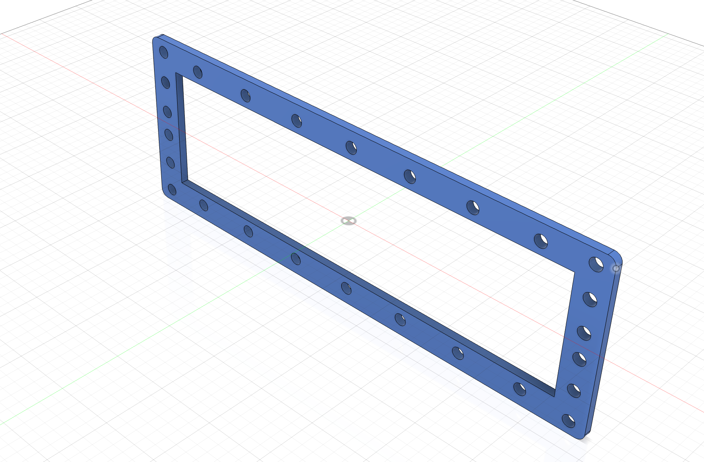

{:class="img-fluid w-100"}

1. Create a new file named `cluster_panel` in Fusion 360

1. Create a new sketch on the XY plane, named `panel_base`

    {:class="img-fluid w-100"}

1. Extrude the body profile by `4mm`:

    {:class="img-fluid w-100"}

1. Create a new sketch on the top of the new part, named `holes`

    {:class="img-fluid w-100"}

1. Extrude-Cut the `holes` sketch:

    {:class="img-fluid w-100"}

---
