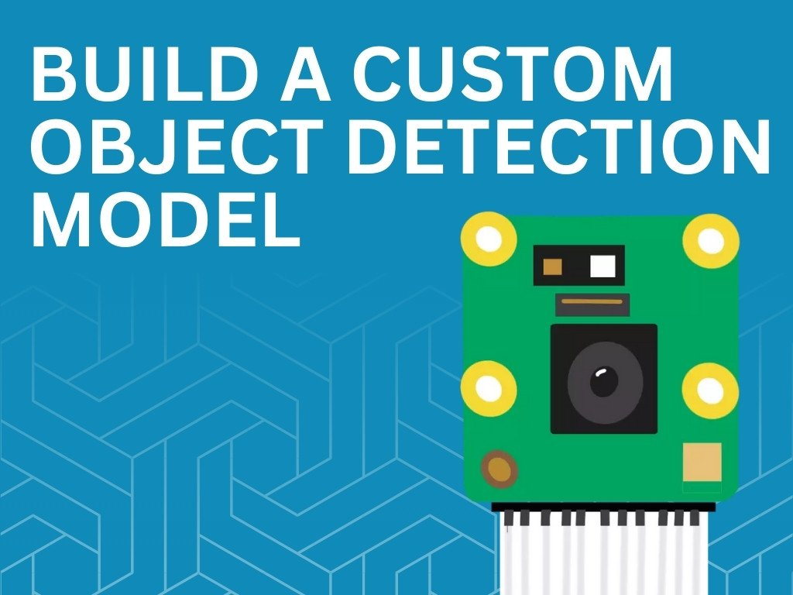

{:class="cover"}

## Overview

Welcome to **Building Object Detection Models with Raspberry Pi AI Camera**!

This hands-on course teaches you how to create your own custom object detection models using PyTorch and deploy them on the Raspberry Pi AI Camera. You'll learn the complete workflow from collecting images, training neural networks, to running real-time object detection on edge devices.

Whether you want to build a smart doorbell that recognizes family members, a robot that finds specific objects, or a quality control system for manufacturing, this course gives you the practical skills to make it happen.

---

## Course Content

In this course you will learn:

- **Setting up your environment** - Jupyter Lab, PyTorch, and annotation tools
- **Dataset preparation** - Collecting images and annotating objects with bounding boxes
- **Model training** - Using transfer learning with pre-trained models
- **Model optimization** - Converting to ONNX format for efficient inference
- **Deployment** - Running your model on Raspberry Pi AI Camera hardware
- **Real-time detection** - Processing camera feeds and visualizing results
- **Troubleshooting** - Common issues and performance optimization

---

## Key Results

After completing this course, you will be able to:

- Create custom object detection datasets with proper annotations
- Train PyTorch models using transfer learning techniques
- Convert and optimize models for edge deployment
- Deploy models to the Raspberry Pi AI Camera
- Build real-time object detection applications
- Troubleshoot and optimize model performance

---

## What You'll Need

### Hardware
- **Raspberry Pi 5** (recommended) or Raspberry Pi 4 (4GB+ RAM)
- **Raspberry Pi AI Camera** with IMX500 sensor
- **MicroSD card** (32GB minimum)
- **Power supply** for Raspberry Pi
- **Computer** for training (Mac/Linux/Windows with 8GB+ RAM)

### Software
- **Python 3.8+** installed on your computer
- **Raspberry Pi OS** (latest version) on your Pi
- **Jupyter Lab** for interactive development
- Basic knowledge of Python programming
- Familiarity with command line/terminal

### Optional but Recommended
- **NVIDIA GPU** for faster training (or use CPU, just takes longer)
- **External storage** for datasets (USB drive or cloud storage)

---

## Real-World Applications

Here are some projects you could build with these skills:

- **Smart home security** - Detect known vs unknown people at your door
- **Agricultural monitoring** - Count fruits, detect pests, monitor crop health
- **Warehouse automation** - Identify and locate inventory items
- **Pet monitoring** - Detect when your pet is near food bowl, door, etc.
- **Maker projects** - Build robots that find and pick up specific objects
- **Quality control** - Identify defects in manufactured parts

---

## How the Course Works

Each lesson builds on the previous one, taking you through the complete workflow:

1. **Theory** - Understanding key concepts
2. **Practice** - Hands-on code examples you can run
3. **Challenges** - "Try it Yourself" exercises to reinforce learning

Code examples are shown like this:

```python
import torch
print(f"PyTorch version: {torch.__version__}")
```

Important notes are highlighted:

> ## Note
>
> Important information you should pay attention to will be highlighted like this

---

## Course Prerequisites

You should have:

- Basic Python programming knowledge (variables, loops, functions)
- Comfortable using command line/terminal
- Understanding of basic machine learning concepts (helpful but not required)

If you're new to Python, check out our [Introduction to Python](/learn/python/) course first.

---

## Estimated Time

- **Total course time**: 6-8 hours
- **Training time** (per model): 1-2 hours depending on hardware
- **Per lesson**: 30-60 minutes

---

## Let's Get Started!

Ready to build your first custom object detection model? Let's dive into setting up your development environment!

---
