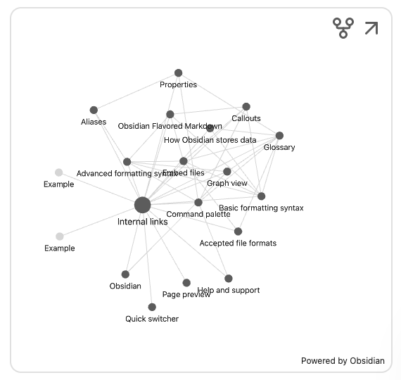

## Markdown in Obsidian

Obsidian stores notes as plain Markdown. Here’s a quick, practical reference tailored for Obsidian.

---

## Headings

Use `#` to `######` for H1–H6. Keep one H1 per note (Obsidian can show the filename as title).

```markdown
# Heading 1
## Heading 2
### Heading 3
```

---

## Emphasis

```markdown
*italic*  _italic_
**bold**  __bold__
~~strikethrough~~
```

---

## Lists

```markdown
- Unordered item
  - Nested item
1. Ordered item
2. Another item
```

Tips:

- Leave a blank line before and after lists for best rendering.

---

## Links

- Wiki-links (best for note-to-note): `[[Note Name]]` or `[[Note Name|Custom text]]`
- External links: `[Text](https://example.com)`

```markdown
See [[This is a note with a tag]] or [Obsidian](https://obsidian.md).
```

---

## Images

Use standard Markdown or drag-and-drop. For site images in this repo:

```markdown

```

---

## Callouts (Obsidian-specific)

```markdown
> [!note]
> Helpful note.
>
> [!tip]
> A handy tip.
>
> [!warning]
> Use with care.
```

---

## Tables

```markdown
| Feature  | Supported |
|---------:|:---------:|
| Tables   |    Yes    |
| Callouts |    Yes    |
```

---

## Code blocks and inline code

Inline: ``Use `code` for short snippets``

Fenced blocks:

```markdown
```python
print("Hello from Obsidian")
```
```

---

## Tasks

```markdown
- [ ] Incomplete task
- [x] Completed task
```

Tip: With the Tasks community plugin, you can query tasks across notes.

---

## Footnotes

```markdown
Here’s a claim with a footnote.[^1]

[^1]: The footnote text.
```

---

## Frontmatter (properties)

```yaml
---
title: "Sample Note"
tags:
  - demo
status: in-progress
---
```

Pairs nicely with Dataview and Bases.

---

## Embeds (notes, images, bases)

- Embed a note: `![[This is a note with a tag]]`
- Embed an image: `![[assets/cover.jpg]]`
- Embed a Base view (pin a specific view):


````markdown
```base
views:
  - type: table
    name: Table
    order:
      - file.name
    sort:
      - property: file.name
        direction: ASC
```
````

---

## Math (optional)

Enable MathJax to use LaTeX:

```markdown
Inline: $E=mc^2$

Block:
$$
\int_a^b f(x)\,dx
$$
```

---

## Keyboard shortcuts

Use Cmd+P to open the Command Palette. Toggle Live Preview/Source Mode via the More menu (…) per note.

---

## Try it now

- Create a new note and add a callout and a task list.
- Link it to another note using wiki-links, then inspect backlinks.
- Add a small table and a fenced code block to test formatting.
