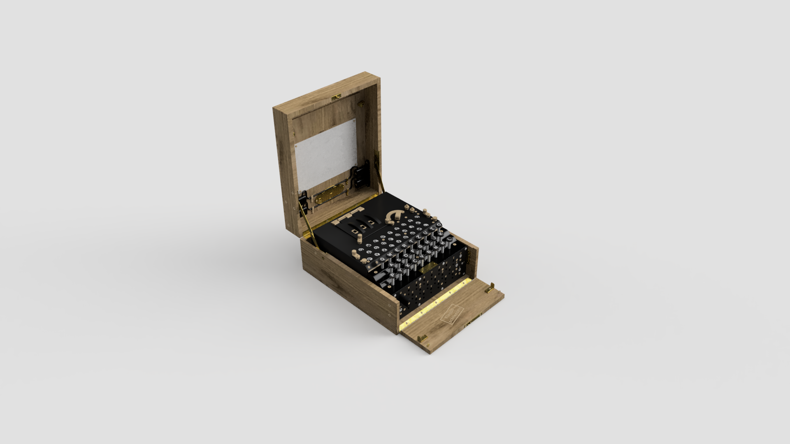
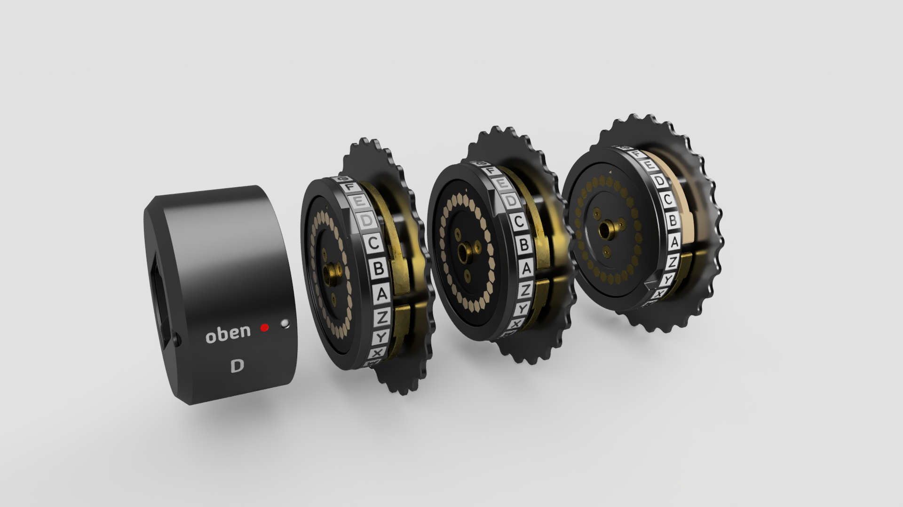
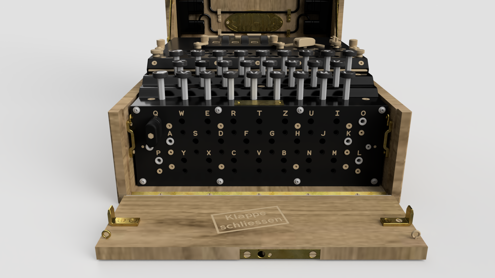

## What is `Py-Engima`?

`Py-Engima` is a Python package that allows you to encrypt and decrypt messages using the Enigma machine. The Enigma machine was used by the Germans during World War II to encrypt and decrypt messages. It was considered unbreakable until the British managed to crack the code, which played a significant role in the outcome of the war.

{:class="img-fluid w-100"}

---

## How to install py-enigma

To install Py-Engima, you can use pip:

```bash
pip install py-enigma
```

---

> ## About the Enigma Machine
>
> The Enigma machine was a complex electro-mechanical device that was used by the Germans during World War II to encrypt and decrypt messages. It used a series of rotors to scramble the letters of the alphabet, making it very difficult to crack the code. The British managed to crack the code using a combination of mathematics, logic, and a lot of hard work. The cracking of the Enigma code played a significant role in the outcome of the war.
>
> ---
>
> ### Rotors
>
> {:class="img-fluid w-100"}
>
> The Enigma machine used a series of rotors to scramble the letters of the alphabet. Each rotor had 26 contacts on one side and 26 contacts on the other side. When a key was pressed, an electrical current would flow through the contacts, causing the rotor to rotate and scramble the letters of the alphabet.
>
> ---
>
> ### Plugboard
>
> {:class="img-fluid w-100"}
>
> The Enigma machine also had a plugboard, which allowed the operator to swap the positions of two letters. This made it even more difficult to crack the code, as the same letter could be represented by different letters at different times. This made it even more difficult to crack the code, as the same letter could be represented by different letters at different times.
>
> ---
>
> ### Reflector
>
> The Enigma machine had a reflector, which caused the electrical current to be reflected back through the rotors, causing them to scramble the letters of the alphabet in a different way. This made it even more difficult to crack the code, as the same letter could be represented by different letters at different times.
>
> ---
>
> ### Slip Rings
>
> The Enigma machine also had slip rings, which allowed the operator to set the initial position of the rotors. This made it even more difficult to crack the code, as the same letter could be represented by different letters at different times.
>
> ---
>
> ## How the Enigma Machine works
>
> The Engima machine has a mechanical keyboard and a series of rotors that scramble the letters of the alphabet. The machine also has a plugboard, a reflector, and slip rings that allow the operator to set the initial position of the rotors. Pressing a key on the keyboard causes an electrical current to flow through the contacts, causing the rotors to rotate and scramble the letters of the alphabet. The electrical current is then reflected back through the rotors, and then through the plugboard. This makes it very difficult to crack the code, as the same letter could be represented by different letters at different times.

{:class="img-fluid w-100"}
---

## How to use py-enigma to encrypt a message

To encrypt a message using Py-Engima, you first need to create an Enigma machine. You can do this by creating an instance of the `EnigmaMachine` class and passing in the rotor settings and plugboard settings. Here's an example:

```python
from enigma.machine import EnigmaMachine

# set up the Enigma machine
machine = EnigmaMachine.from_key_sheet(
       rotors='I II III',
       reflector='B',
       ring_settings=[1, 20, 11],
       plugboard_settings='AV BS CG DL FU HZ IN KM OW RX')

# set the initial position of the rotors
machine.set_display('WXC')

# encrypt the message
ciphertext = machine.process_text('HELLO')

print(ciphertext)
```

---
