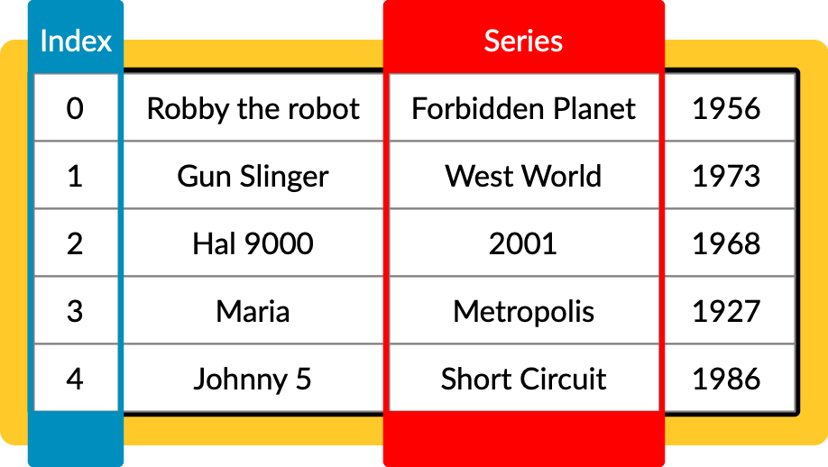
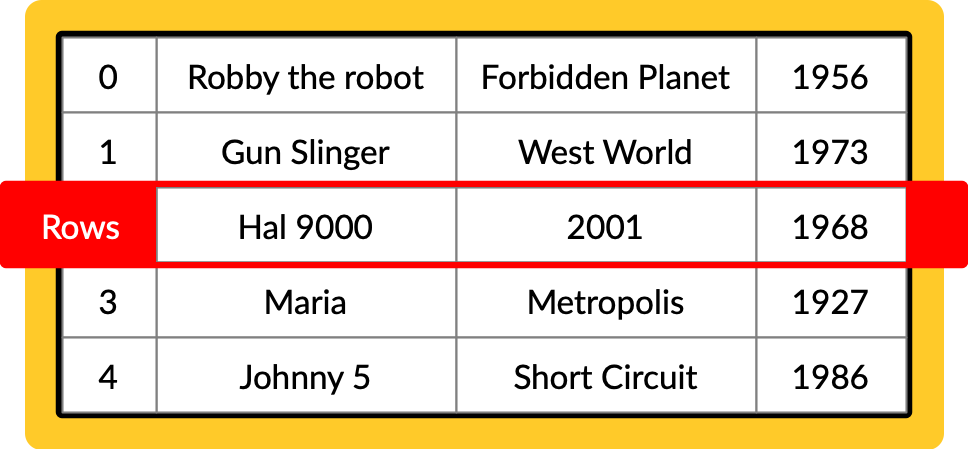

{:class="cover"}

## Overview

Welcome to the exciting lesson on Data Frames in Pandas. Data Frames are one of the most important and widely used data structures in Pandas. They allow you to store and manipulate tabular data efficiently. In this lesson, we'll explore creating Data Frames, performing basic operations, and how they can be used in data analysis.

---

## What is a Data Frame?

A Data Frame in Pandas is a two-dimensional, size-mutable[^1], and potentially heterogeneous[^2] tabular data structure with labeled axes (rows and columns). It's akin to a spreadsheet or SQL table and is the most commonly used Pandas object.

**A Pandas Data Frame**

{:class="img-fluid w-50"}

---

**Data Frame Axis**

Data Frame Axis are the horizontal and vertical lines that contain the labels for rows and columns. The horizontal axis is called the index, and the vertical axis is called the columns.

{:class="img-fluid w-50"}

---

**Data Frame Series**

Data Frame Series are one-dimensional labeled arrays capable of holding data of any type (integer, string, float, etc.). They are the building blocks of Data Frames.

{:class="img-fluid w-50"}

---

**Data Frame Rows**

Data Frame Rows are the horizontal lines that contain the data. Each row is assigned a unique index value.

{:class="img-fluid w-50"}

---

[^1]: Size-mutable means that the size of a Data Frame can be changed after creation. 

[^2]: Heterogeneous means that the data in a Data Frame can be of different types (e.g., integer, float, string, etc.).

---

## Why use Data Frames?

DataFrames, a fundamental feature of pandas in Python, are widely used in data analysis for several reasons:

1. **Structured Data Representation**: DataFrames provide a tabular structure, which is intuitive and aligns well with how data is often organized (similar to spreadsheets).

2. **Efficient Data Manipulation**: They allow for efficient, easy manipulation of data, including filtering, replacing, and aggregating values.

3. **Handling Large Datasets**: DataFrames are optimized for performance, enabling the handling of large datasets effectively.

4. **Data Analysis**: They offer numerous built-in methods for data analysis, making it easier to perform complex statistical analysis, groupings, and pivots.

5. **Integration with Other Tools**: DataFrames seamlessly integrate with a variety of data sources and can be easily exported to different file formats.

6. **Visualization Support**: They are compatible with various data visualization libraries, simplifying the creation of charts and graphs from the data.

7. **Ease of Use**: Pandas DataFrames have a user-friendly syntax, making data manipulation and analysis more accessible.

In summary, DataFrames simplify data manipulation and analysis, making them a preferred choice for data scientists and analysts.

---

## Creating a Data Frame

You can create a Data Frame from various sources like lists, dictionaries, or external data sources (CSV, Excel files). Here's an example of creating a Data Frame from a dictionary:

```python
import pandas as pd

data = {
    'Name': ['Alice', 'Bob', 'Charlie'],
    'Age': [25, 30, 35],
    'City': ['New York', 'Paris', 'London']
}

df = pd.DataFrame(data)
print(df)
```

---

## Data Frame Shape

You can check the shape of a Data Frame using `df.shape`:

```python
print(df.shape)
```

This will produce the output:

```shell
(3, 3)
```

This means the Data Frame has 3 rows and 3 columns.

---

## Basic Operations

### Viewing Data

To view the top and bottom rows of the frame, use `df.head()` and `df.tail()`:

```python
print(df.head()) # first five rows
print(df.tail()) # last five rows
```

---

### Data Selection

You can select a specific column or row from a Data Frame:

```python
# Selecting a column
print(df['Name'])

# Selecting a row
print(df.iloc[1])
```

---

### Adding and Deleting Columns

You can easily add new columns or remove existing ones:

```python
# Adding a new column
df['Salary'] = [70000, 80000, 90000]

# Deleting a column
del df['Age']
```
---

### Replacing data in Columns

You can easily replace data in a column:

```python
# Replacing data in a column
df['Salary'] = [75000, 85000, 95000]
```

---

If you want to replace just a single value, you can use `df.replace()`:

```python
# Replacing a single value
df['Salary'] = df['Salary'].replace(75000, 76000)
```

---

## Code Playground

Experiment with what you have learned in this lesson below:

<iframe src="https://trinket.io/embed/python3/cfd2d123f3?runOption=run&showInstructions=true" width="100%" height="300" frameborder="0" marginwidth="0" marginheight="0" allowfullscreen></iframe>

---

## Summary

This lesson introduced the basics of Data Frames in Pandas. We explored how to create Data Frames, perform basic operations, and how they serve as a cornerstone for data manipulation in Python.

---
