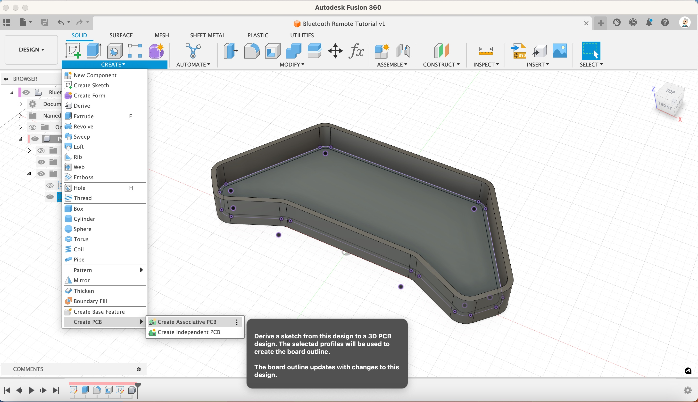
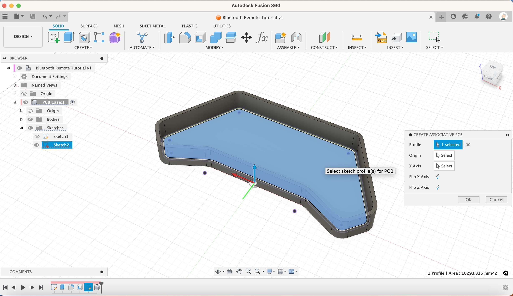
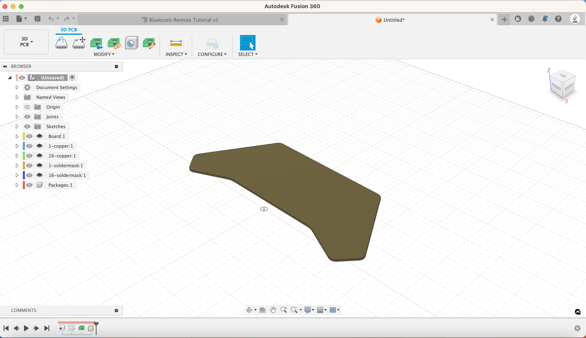

1. Create a PCB from the sketch using Associative Design

   [{:class="img-fluid w-05 shadow-lg rounded-3"}](assets/pcb10.jpg)

1. Choose the profile from the sketch

   [{:class="img-fluid w-05 shadow-lg rounded-3"}](assets/pcb11.jpg)

1. Choose the bottom edge of the sketch as the X axis, the Z axis will face up correctly, Click OK

   This will create a new untitled PCB.

   [{:class="img-fluid w-05 shadow-lg rounded-3"}](assets/pcb12.jpg)

1. Save the PCB as `Remote Control`

---
