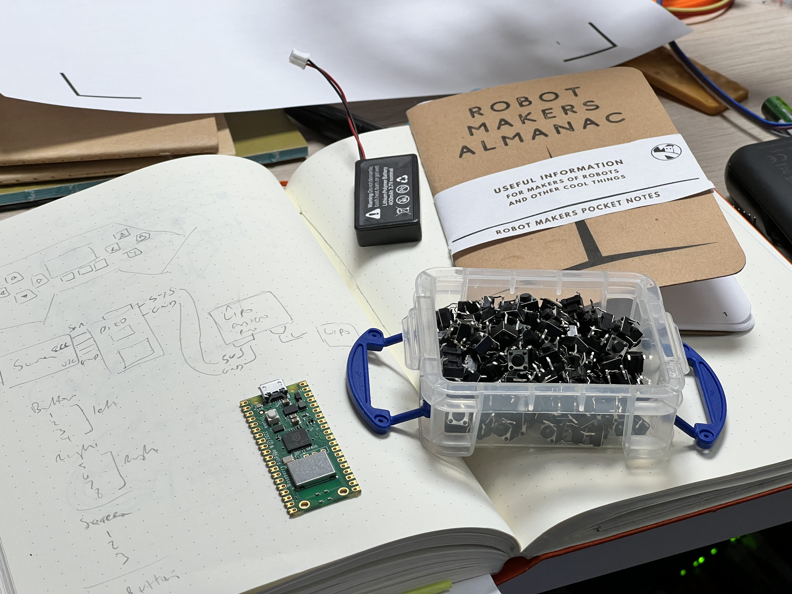
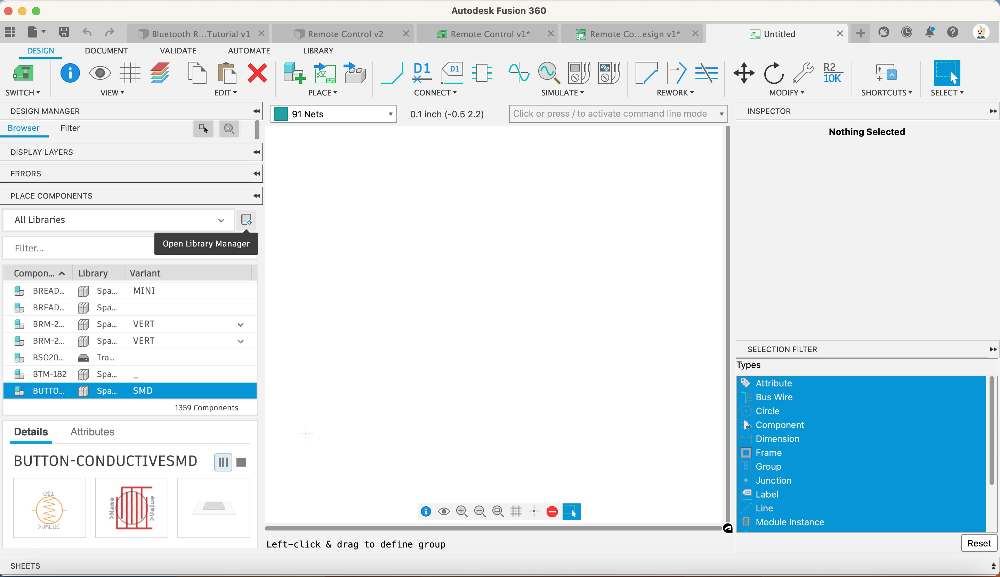

We’re going to place 4 momentary tact buttons (switches) onto our schematic and connect them to a Raspberry Pi Pico. We’ll also add a battery connector and another 4 buttons

First let’s find the switches in a library. Luckily Fusion has a bunch of libraries we can search in

---

1. Click the Open Library Manager button

    [{:class="img-fluid w-05 shadow-lg rounded-3"}](assets/pcb20.jpg)

    In the filter section type ‘1-1825910-0’ - this is a model number for a momentary switch (or tactile switch).

1. Click it and then click on the canvas 4 times

    [{:class="img-fluid w-05 shadow-lg rounded-3"}](assets/pcb21.jpg)

    It will place a symbol each time you click.

1. Press Escape to stop placing this type of symbol

---
