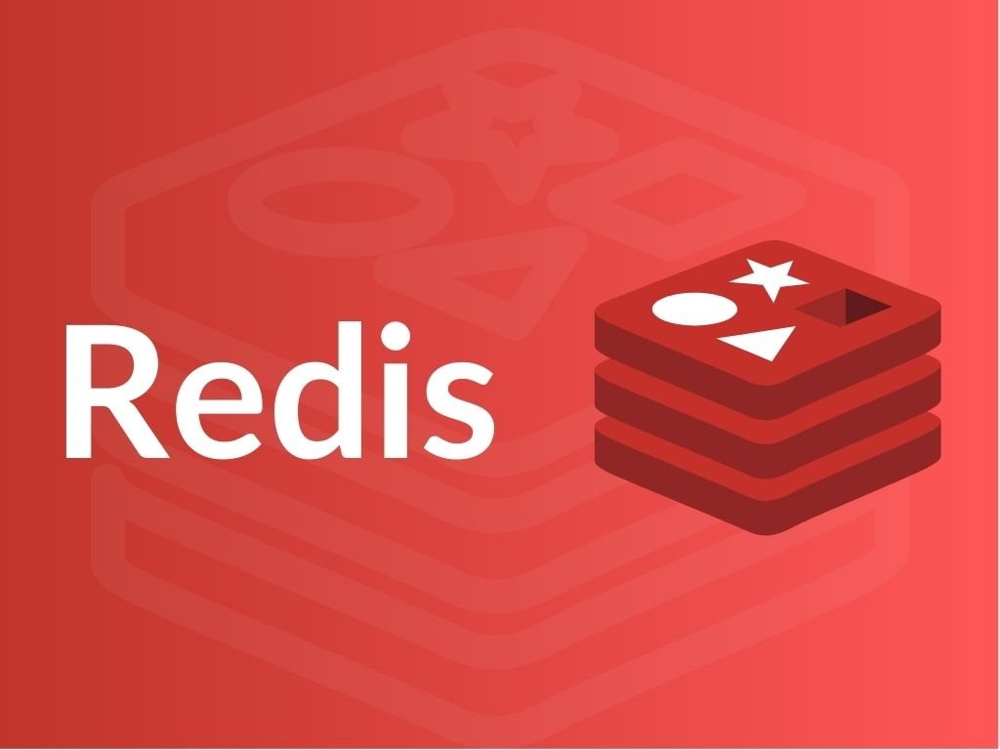

{:class="cover"}

### Overview

Welcome to the first lesson of the `Using Redis with Python` course. In this lesson, we will introduce `Redis` and its use cases. You will learn what Redis is, why you should use it, and where to download it.

---

### Lesson Content

In this lesson, we will cover:

* [What is Redis?](#what-is-redis)
* [Redis use cases](#redis-use-cases)
* [Where to download Redis](#where-to-download-redis))

---

### What is Redis?

Redis is an in-memory data structure store that can be used as a database, cache, and message broker. Redis supports a wide variety of data structures, including strings, hashes, lists, sets, and sorted sets. Redis is designed to be fast, efficient, and scalable.

---

### Redis use cases

Redis has many use cases, including:

* Caching frequently accessed data to improve application performance
* Storing session data for web applications
* Building real-time applications with pub/sub messaging
* Implementing leaderboards, analytics, and other high-performance applications

---

### Where to download Redis

You can download Redis from the official Redis website at <https://redis.io/download>. Redis is available for Windows, macOS, and Linux.

---

### Key Takeaways

After completing this lesson, you should have a basic understanding of what Redis is, why you should use it, and where to download it.

### What you'll need

To complete this lesson, you will need:

* A computer with an internet connection
* A web browser
* Optional: A Redis installation for testing and experimentation

---

### Conclusion

In this lesson, we introduced Redis and its use cases. We covered what Redis is, why you should use it, and where to download it. In the next lesson, we will cover how to use Redis with Python.

---
