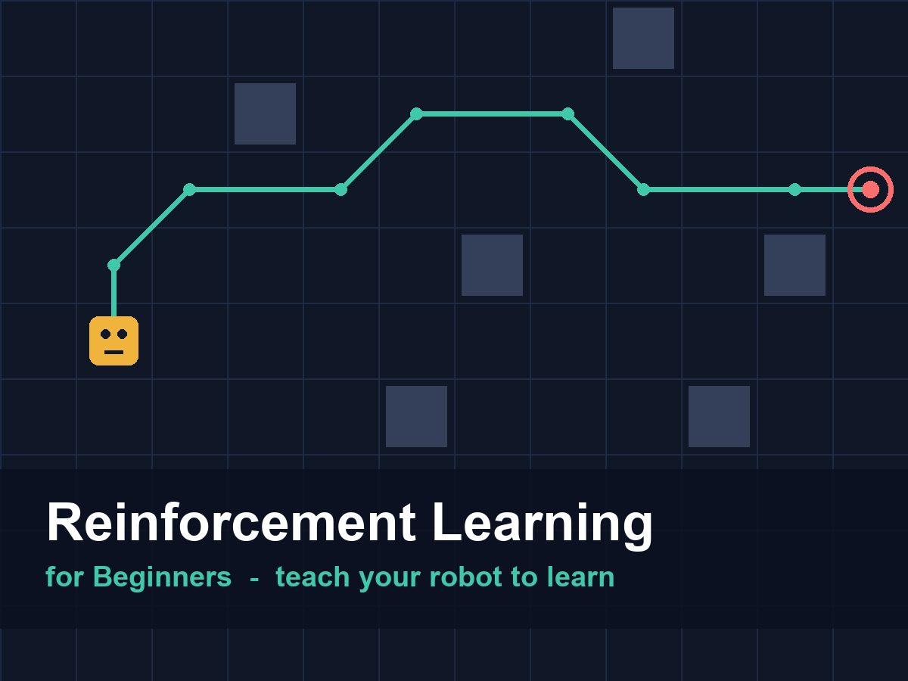

{:class="cover"}

---

The bridge between simulation and reality is the discretisation function. In training, `_read_sensor()` returned a nice clean label from a perfect model. On the Pico, we need real MicroPython code that reads an actual HC-SR04, filters out noise, and produces exactly the same "near" / "medium" / "far" labels — so the Q-table we trained still makes sense.

This lesson is the first one that targets the Pico directly. If you haven't set up MicroPython on your Pico yet, follow the [MicroPython Robotics Projects](/learn/micropython_robotics/) course first — lesson 5 covers the HC-SR04 wiring we use here.

---

## Wiring Recap

For this course, use the same pin assignments as the MicroPython Robotics course:

| HC-SR04 pin | Pico pin |
|---|---|
| VCC | 3.3V (use 3.3V-compatible sensor) |
| GND | GND |
| TRIG | GP8 |
| ECHO | GP9 (via voltage divider if using 5V sensor) |

**Voltage divider for 5V ECHO (protects the Pico):**

```
HC-SR04 ECHO  ──┬── 1kΩ ──── Pico GP9
                │
               2kΩ
                │
               GND
```

---

## Raw HC-SR04 Reading in MicroPython

The basic driver from lesson 5 of the robotics course:

```python
from machine import Pin, time_pulse_us
from time import sleep_us, sleep_ms

# Pin setup
TRIG = Pin(8, Pin.OUT)
ECHO = Pin(9, Pin.IN)

def get_distance_cm():
    """
    Fire the HC-SR04 and return distance in centimetres.

    Returns:
        float: distance in cm, or -1.0 if the reading timed out
    """
    # Ensure trigger is low before starting
    TRIG.low()
    sleep_us(2)

    # 10 µs trigger pulse
    TRIG.high()
    sleep_us(10)
    TRIG.low()

    # Measure the echo pulse width; timeout after 30 ms
    # (30 ms covers distances up to ~5 m, plenty for our use)
    duration_us = time_pulse_us(ECHO, 1, 30000)

    if duration_us < 0:
        return -1.0   # timeout — no echo received

    # Speed of sound: ~343 m/s = 0.0343 cm/µs
    # Distance = (duration / 2) * 0.0343
    # Simplified: duration_us / 58
    distance_cm = duration_us / 58.0
    return distance_cm
```

---

## Median-of-Three Filtering

Raw readings from the HC-SR04 occasionally contain outliers: reflections off a moving object, a brief dropout, or a glitch from a nearby motor. Taking three readings in quick succession and returning the middle value removes most of these without adding significant latency.

```python
def get_distance_filtered():
    """
    Take three HC-SR04 readings and return the median.

    Three readings take approximately 60 ms total (20 ms each).
    This latency is acceptable for our 100 ms control loop.

    Returns:
        float: median distance in cm, or -1.0 if all readings failed
    """
    readings = []

    for _ in range(3):
        d = get_distance_cm()
        if d > 0:   # ignore timeout readings
            readings.append(d)
        sleep_ms(20)   # wait between pulses to avoid echo interference

    if not readings:
        return -1.0   # all readings failed

    readings.sort()
    return readings[len(readings) // 2]   # median
```

> **Tip:** If you find three readings too slow (e.g. the robot is moving fast), you can use two readings and return the minimum (conservative: treat the closer reading as correct). Never use just one raw reading without filtering.

---

## Mapping to the Same State Bins as Training

The discretisation function must use exactly the same thresholds you set in `train.py`. The real-world version uses centimetres instead of grid cells, so we need to translate:

In the simulation:
- "near"   = 0–1 grid cells ahead
- "medium" = 2–3 grid cells ahead
- "far"    = 4+ grid cells ahead

Each grid cell in our simulation represents roughly one robot-body-length. For a BurgerBot-sized robot (about 15–20 cm long), a sensible translation is:

| Simulation | Real world |
|---|---|
| "near"   (≤ 1 cell) | < 15 cm |
| "medium" (≤ 3 cells) | 15–40 cm |
| "far"    (> 3 cells) | > 40 cm |

```python
def discretize_distance(distance_cm):
    """
    Map a real HC-SR04 reading to the same state labels used in training.

    The thresholds here MUST match what the simulation used.
    If training used near=1 cell and each cell ~= 15 cm of real space,
    then near_threshold_cm = 15.

    Args:
        distance_cm (float): filtered distance reading in centimetres
                             Use -1.0 to signal "sensor failed"

    Returns:
        str: 'near', 'medium', or 'far'
    """
    if distance_cm < 0:
        # Sensor failed or timed out — treat as obstacle very close
        # (conservative: assume something is there)
        return "near"

    if distance_cm < 15:
        return "near"
    elif distance_cm < 40:
        return "medium"
    else:
        return "far"
```

---

## Tracking Heading Without Encoders

In simulation, we tracked heading perfectly. On the real robot without encoders or a gyroscope, heading is estimated by counting turns:

```python
# Heading tracking without sensors
HEADINGS = ["north", "east", "south", "west"]
current_heading_idx = 1   # start facing east

def turn_left_and_track():
    global current_heading_idx
    # Execute the physical turn (motor code below)
    do_turn_left()
    # Update our heading estimate
    current_heading_idx = (current_heading_idx - 1) % 4

def turn_right_and_track():
    global current_heading_idx
    do_turn_right()
    current_heading_idx = (current_heading_idx + 1) % 4

def get_heading():
    return HEADINGS[current_heading_idx]
```

This is an approximation — physical turns won't be exactly 90°. As discussed in lesson 11, this is part of the sim-to-real gap. For best results, calibrate your turn duration carefully and run on a consistent floor surface.

---

## Putting It Together: The State Reader

Combining position tracking, heading tracking, and sensor reading into a single `get_state()` function that the Q-table lookup expects:

```python
# Pico state reader (simplified — no grid position tracking)
# For the real robot we use heading + sensor only,
# since we can't accurately track (row, col) without encoders.

def get_state():
    """
    Read the current state for Q-table lookup.

    On the real robot, we omit (row, col) because we can't track
    grid position accurately without encoders. The Q-table was trained
    with position, so we need a modified lookup that uses only
    the heading and distance band.

    Returns:
        tuple: (heading, distance_band)
    """
    distance_cm = get_distance_filtered()
    band = discretize_distance(distance_cm)
    heading = get_heading()
    return (heading, band)
```

> **Note:** we're dropping (row, col) from the state on the real robot because we can't track grid position accurately without encoders. In lesson 13, we'll load a Q-table that was retrained in simulation using only (heading, distance_band) as the state — a simpler representation that works well on the real hardware. We'll make that change in `train.py` before the final deployment.

---

## Try It Yourself

1. Connect your HC-SR04 to the Pico and copy `get_distance_filtered()` to a new file. Test it by holding objects at known distances (use a ruler). Verify that readings within 5% of the true distance at 10 cm, 25 cm, and 60 cm.

2. Write a loop that calls `get_state()` every 200 ms and prints the result. Move your hand toward and away from the sensor. Confirm that the state transitions through "far" → "medium" → "near" at the expected distances.

3. Add a voltage check: measure the battery voltage using the ADC on GP26 (or use a multimeter) and add a warning if it drops below 6V (for a 2-cell LiPo) or 5V (for 4×AA). Print "LOW BATTERY — policy may degrade" if the threshold is crossed.

---

## Common Issues

**"The sensor always returns -1.0 (timeout)."**
Check the TRIG and ECHO wiring. Verify the TRIG pin can drive the sensor (measure with a logic probe or LED). Check that the ECHO line voltage is safe for the Pico (max 3.3V — use a voltage divider if needed).

**"Readings jump wildly between 2 cm and 400 cm."**
The echo is reflecting off something behind the sensor (wiring, chassis). Move the sensor to the front of the robot with a clear forward view. The median filter will catch occasional outliers, but not systematic double-bounce echoes.

**"The robot changes state too quickly — 'near' then 'far' then 'near' in quick succession."**
Increase the delay between readings from 20 ms to 50 ms, and consider only accepting a new state if it's been stable for two consecutive readings (hysteresis).

**"My distance readings are consistently 20% too long."**
The speed of sound varies with temperature. At 20°C the constant is 58 µs/cm; at 0°C it's about 61 µs/cm. For most indoor use this doesn't matter, but if accuracy is critical, add a temperature correction term.

---

Next up: putting it all together — loading the Q-table on the Pico and running the full motor control loop.

---
