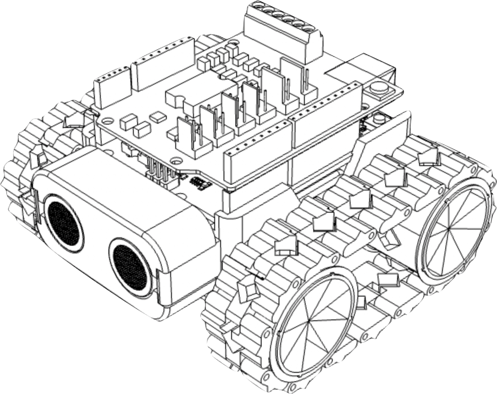
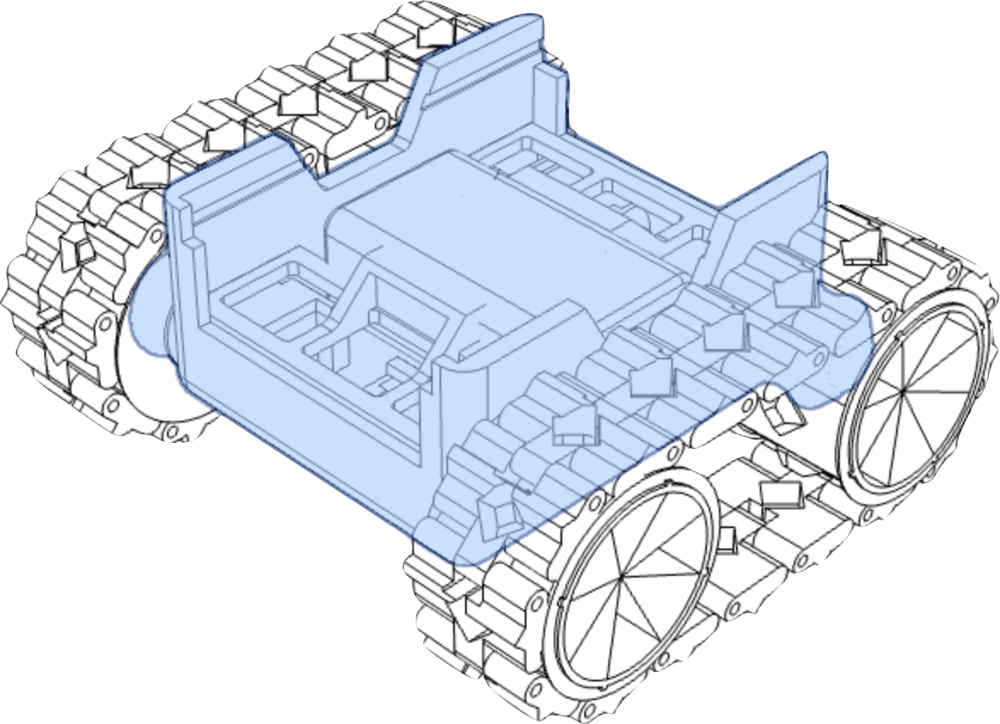
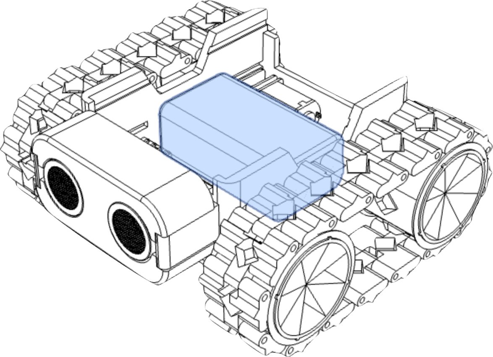
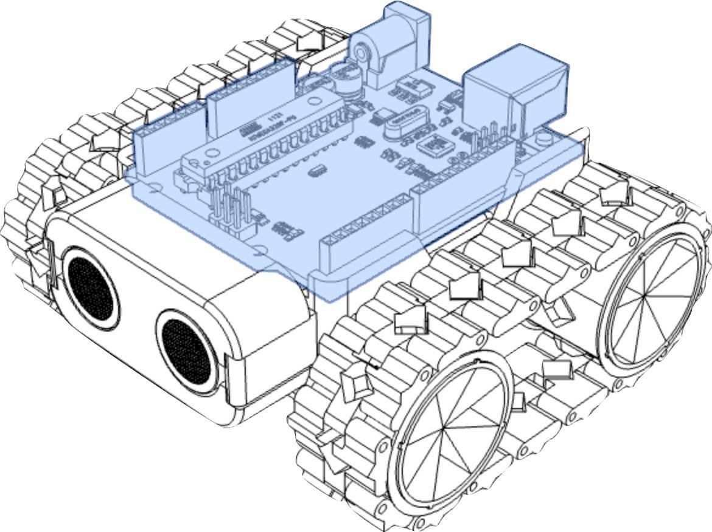
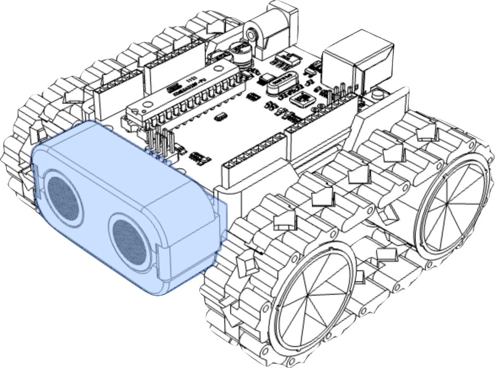
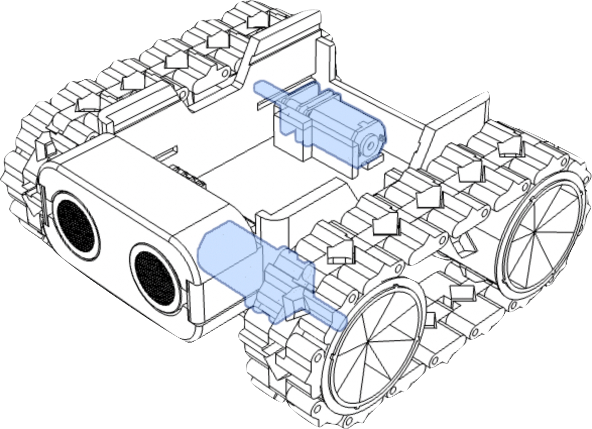
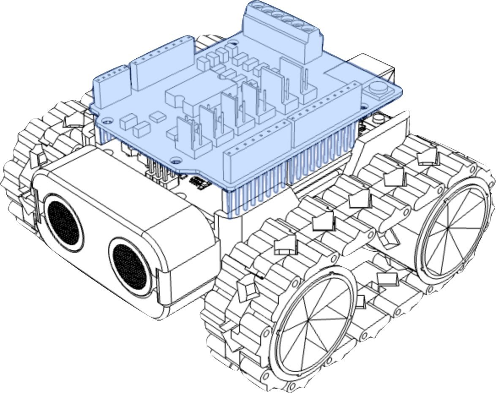

Robots is made up of lots of different parts, for example:

- A [brain](#the-brain-(processor)) (Processor)
- A [body](#the-body) (Chassis)
- A [power source, or battery](#the-battery)
- [Sensors](#the-sensors)
- [Motors](#the-motors) (Or [Actuators](/resources/glossary#actuator))
- [Motor driver](#the-motorshield)

{:class="img-fluid w-25"}

---

### The Body

Houses all the parts

Robots need somewhere to house the different parts, and prevent dust or other particulates getting into inside of the robot:

- The Brain
- The Power source
- The Motors
- The Sensors

{:class="img-fluid w-25"}

---

### The Battery

Provides power, when the robot is not connected to an external power supply.

Robots needs a battery to power the electronics including:

- **The Brain**, so it can ‘think’ and run programs
- **The Motors**, so it can move and react
- **The Sensors**, so it can feel, see and hear

SMARS is powered by a 9v Battery

{:class="img-fluid w-25"}

---

### The Brain (Processor)

Runs programs, connects to sensors and motors

- Most robots have a computer or micro-controller to perform the instructions from the program
- The ‘brain’ could just be a simple circuit, without a central processing unit (CPU)
- Common microcontrollers include:
  - BBC micro:bit
  - Raspberry Pi Pico
  - Arduino Uno
  - NodeMCU (ESP8266)

  SMARS uses an Arduino Uno for its brain

{:class="img-fluid w-25"}

  ---

### The Sensors

Provides information about the outside world to the Robot:

- Robots need sensors to detect, measure and provide input to the brain so it can make decisions
- Common sensors include:
  - Switches and buttons
  - Range finders
  - Temperature, Humidity sensors
  - Infrared & Ultrasonic sensors
  - Lasers
  - Cameras
  - Microphones

  SMARS uses an [ultrasonic range](/resources/glossary#ultrasonic) finder to ‘see’

{:class="img-fluid w-25"}

---

### The Motors

Enable the robot to move around

- Robots use outputs, such as Motors to move around and interact with their environment
- Motors rotate a set speed and direction
- Turning the motors in the same direction moves the robot forward or backward
- Turning the motors in opposite directions rotates the robot

SMARS uses two motors to move about

{:class="img-fluid w-25"}

---

### The Motorshield

Also known as a Motor driver; Enable the robot to power the motors:

- A Motorshield routes power to the motors - they need much more power than the brain
- Motorshields can also bring extra outputs such as a buzzer
- The motorshield sits on top of the Arduino and the connector pins push into the header pins on the Arduino

SMARS uses motorshield to power and control the motors

{:class="img-fluid w-25"}

---
