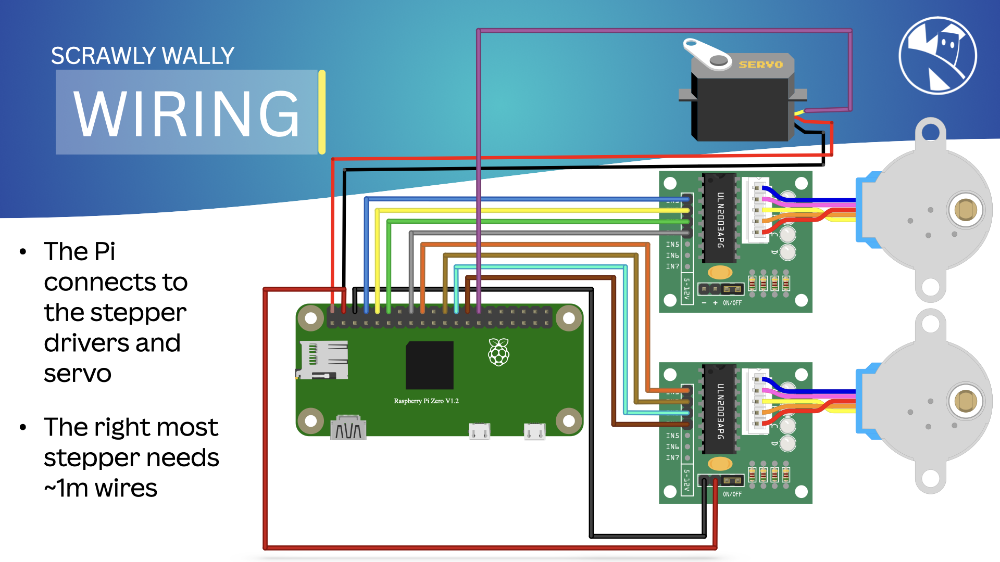

{:class="cover"}

---

## Wiring

Follow these steps to wire the components:

Item | Action
--- | ---
 **Connect the Stepper Motors**: Connect the 28BYJ-48 stepper motors to the ULN2003 driver boards. Connect the `IN1`, `IN2`, `IN3`, and `IN4` pins on the driver boards to GPIO pins on the Raspberry Pi.  **Connect the Servo Motor**: Connect the servo motor to a PWM-capable GPIO pin on the Raspberry Pi. Connect the power and ground wires of the servo to the Raspberry Pi.  **Power the Raspberry Pi**: Ensure your Raspberry Pi has a stable power supply. | {:class="w-100 img-fluid rounded-3 card-shadow card-hover"}
{:class="table table-striped"}

---

## Pin Connections

Here are the pin connections for the components:

Component          | Raspberry Pi Pin
-------------------|-----------------
Left Stepper, IN1  | `GPIO 14`
Left Stepper, IN2  | `GPIO 15`
Left Stepper, IN3  | `GPIO 18`
Left Stepper, IN4  | `GPIO 23`
Right Stepper, IN1 | `GPIO 24`
Right Stepper, IN2 | `GPIO 25`
Right Stepper, IN3 | `GPIO 08`
Right Stepper, IN4 | `GPIO 07`
Servo Signal       | `GPIO 01`
{:class="table table-striped"}

---

With the wiring done, we can now proceed to setting up the Raspberry Pi.

---
