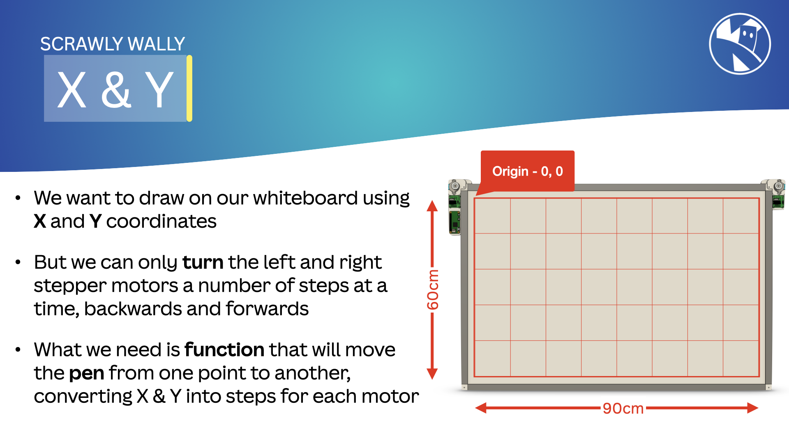
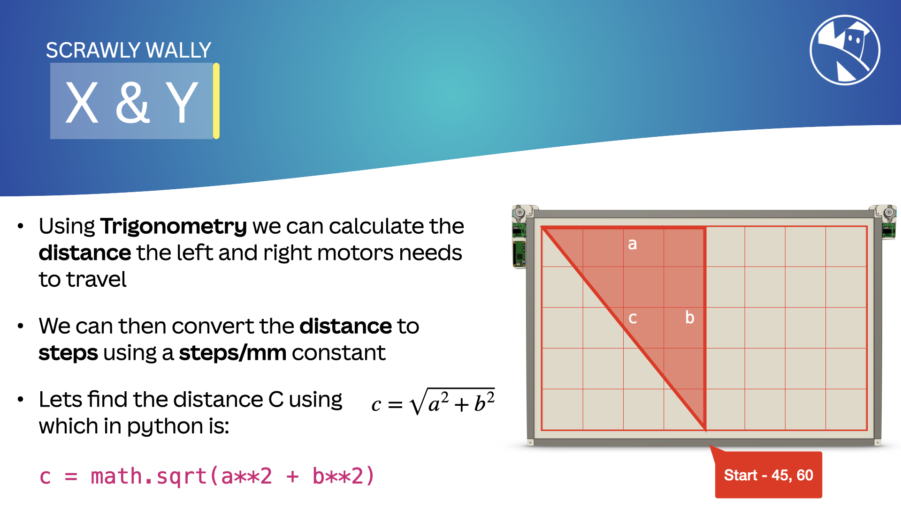
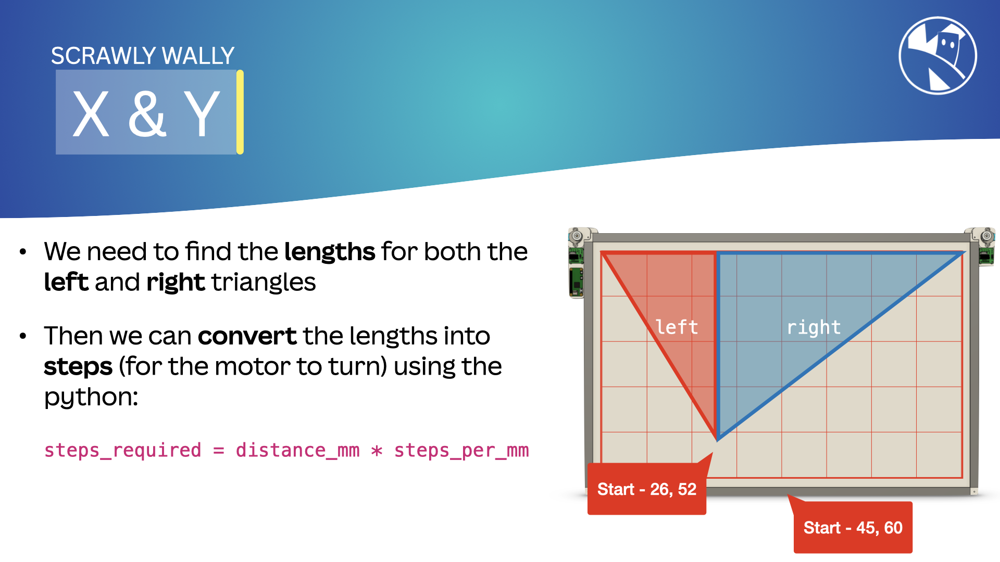

## Understanding Positioning with Trigonometry

To accurately move the gondola and draw on the wall, the robot needs to calculate the position of the gondola using the lengths of the strings attached to the motors. This involves simple trigonometry and math.

{:class="img-fluid w-100 card-hover card-shadow rounded-3 "}

### Basic Concepts

The wall drawing robot operates in a 2D plane. Each stepper motor controls one side of the gondola. By adjusting the lengths of the strings, we can move the gondola to any position (X, Y) on the wall.

### Geometry of the System

{:class="img-fluid w-100 card-hover card-shadow rounded-3 "}

{:class="img-fluid w-100 card-hover card-shadow rounded-3 "}

Consider the following setup:

- The two motors are mounted at points (0, 0) and (W, 0), where W is the width of the drawing area.
- The gondola is at position (X, Y).
- The lengths of the strings from the motors to the gondola are L1 and L2.

We can use the Pythagorean theorem to relate these lengths to the position of the gondola.

### Calculating Lengths

```python
# Calculate the length of string from Motor 1 (L1)
L1 = math.sqrt(X**2 + Y**2)

# Calculate the length of string from Motor 2 (L2)
L2 = math.sqrt((W - X)**2 + Y**2)
```

These formulas allow us to calculate the lengths of the strings based on the desired position of the gondola.

---

### Inverse Calculation

To move the gondola to a specific position (X, Y), we can use the calculated lengths (L1 and L2) to determine the steps needed for each stepper motor.

---

### Implementing in Code

Here's an example of how to implement this in Python:

```python
import math

def calculate_lengths(x, y, w):
    L1 = math.sqrt(x**2 + y**2)
    L2 = math.sqrt((w - x)**2 + y**2)
    return L1, L2

# Example usage:
W = 100  # Width of the drawing area in centimeters
X = 50   # Desired X position
Y = 50   # Desired Y position

L1, L2 = calculate_lengths(X, Y, W)
print(f"Length of string from Motor 1: {L1} cm")
print(f"Length of string from Motor 2: {L2} cm")
```

---
