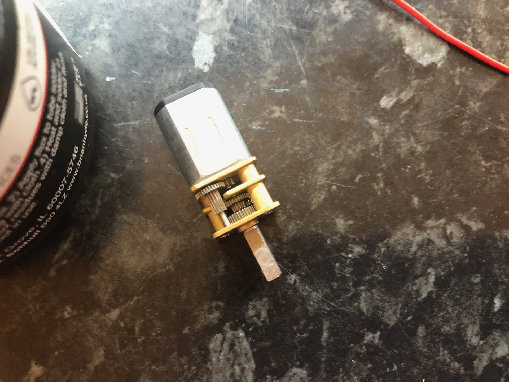
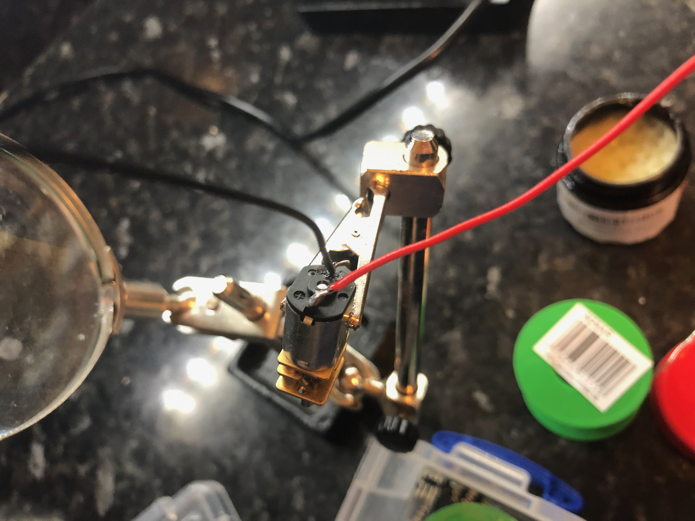

## Preparation

Prep the motor by:

- putting some flux on the contacts
- putting flux on the wires

---

## Motor

{:class="img-fluid w-50"}

---

## Solder wires to motors

- solder a 15cm red wire to the positive terminal
- solder a 15cm black wire to the negative terminal

---

{:class="img-fluid w-50"}

After soldering, twist the red and black wires to secure them further. It also makes the wires easier to manage.

---
