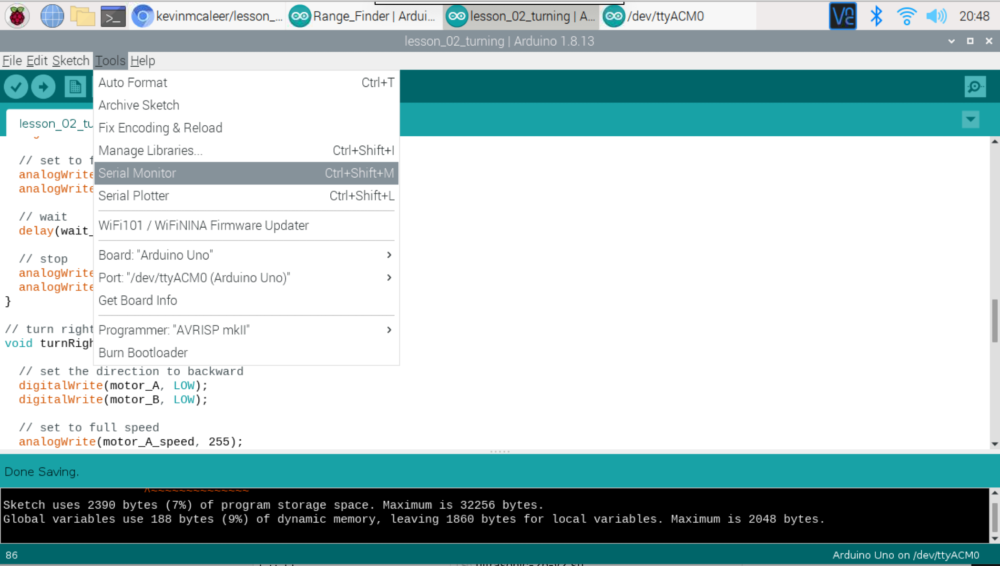
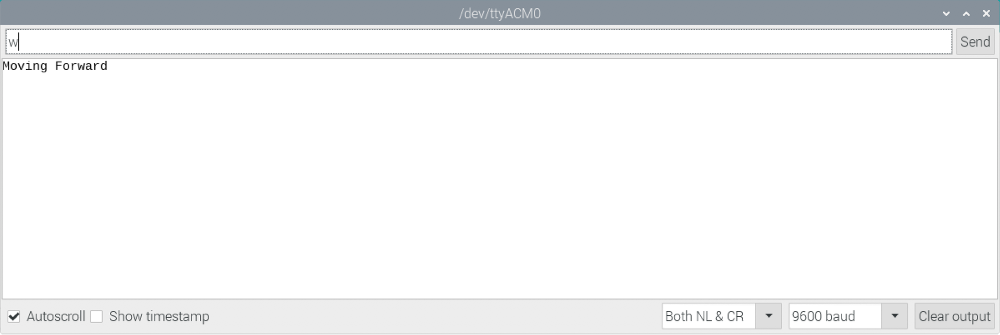

## What you'll learn

In this lesson you will learn how to move your robot backwards, turning left and right, and finally creating some code to control the SMARS over the serial port.

You can download the completed code from [GitHub - www.github.com/kevinmcaleer/lesson_02_turning](https://github.com/kevinmcaleer/lesson_02_turning)

---

## Things's you'll needs

Before you begin, you'll need to make sure you have a couple of things before you start this lesson:

* A [SMARS robot](/learn/smars/)
* A USB Cable to connect to your computer
* A Computer that can run the [Arduino IDE](https://create.arduino.cc/editor)
* The code from [Lesson 01 - Movement](01_lesson_01)

---

## Preparation

1. Connect the SMARS to the USB cable, and the USB Cable to your computer
1. Launch the [Arduino IDE](https://create.arduino.cc/editor) on your computer
1. Create a new Sketch, by clicking the `New Sketch` button

---

## Lets code

We are going to create 3 more functions, almost identical to the function we made in [lesson 01](01_lesson_01), but with slightly different parameters for the direction of the motors.

---

## Moving backwards

``` c
// move backward
void backward() {

  // set the direction to backward
  digitalWrite(motor_A, HIGH);
  digitalWrite(motor_B, LOW);

  // set to full speed
  analogWrite(motor_A_speed, 255);
  analogWrite(motor_B_speed, 255);

  // wait
  delay(wait_in_milliseconds);

  // stop
  analogWrite(motor_A_speed, 0);
  analogWrite(motor_B_speed, 0);
}
```

---

## Turning Left

``` c
// turn left
void turnLeft() {

  // set the direction to backward
  digitalWrite(motor_A, LOW);
  digitalWrite(motor_B, LOW);

  // set to full speed
  analogWrite(motor_A_speed, 255);
  analogWrite(motor_B_speed, 255);

  // wait
  delay(wait_in_milliseconds);

  // stop
  analogWrite(motor_A_speed, 0);
  analogWrite(motor_B_speed, 0);
}
```

---

## Turning Right

``` c
// turn right
void turnRight() {

  // set the direction to backward
  digitalWrite(motor_A, HIGH);
  digitalWrite(motor_B, HIGH);

  // set to full speed
  analogWrite(motor_A_speed, 255);
  analogWrite(motor_B_speed, 255);

  // wait
  delay(wait_in_milliseconds);

  // stop
  analogWrite(motor_A_speed, 0);
  analogWrite(motor_B_speed, 0);
}
```

---

## What the code means

The code in each of these functions is virtually identical, apart from these line:

``` c
digitalWrite(motor_A, HIGH);
digitalWrite(motor_B, HIGH;
```

These lines tell the motor-shield to set motor A and motor B to either rotate in different directions to move either backwards or forwards, or in the same direction to turn the SMARS either left or right. The reason for this is that the motors on the SMARS are facing opposite directions and therefore need to rotate in opposite directions to move the SMARS in a single direction. Rotating the motors in opposite directions has the affect of turning the body either left or right.

---

## Remote Control

{:class="img-fluid w-25"}

To make the SMARS controllable from the keyboard, we can use the Arduino Serial Monitor to issue commands to our SMARS. We will do this by creating a new piece of code that will look for the following 4 keys from the keyboard:

* W - Forward
* S - Backward
* A - Left
* D - Right

We will do this by reading in characters from the Serial interface, and then running either the `forward()`, `backward()`, `turnLeft()`, or `turnRight()` functions.

We will change the code in the `void loop()` section to looks like this:

``` c
while (Serial.available()) {
    char c = Serial.read();
    switch(c) {
        // press the 'w' key to move SMARS Forward
        case 'w':
        Serial.println("Moving Forward");
        forward();
        break;

        // press the 's' key to move SMARS backward
        case 's':
        Serial.println("Moving Backward");
        backward();
        break;

        // press the 'a' key to move SMARS left
        case 'a':
        Serial.println("Turning Left");
        turnLeft();
        break;

        // press the 'd' key to move SMARS right
        case 'd':
        Serial.println("Turning Right");
        turnRight();
        break;
        }
  }
  // wait 2 seconds
  delay(2000);
```

We can now open the Serial monitor from the Tools menu, and being typing any of the four direction commands 'w','s','a','d' and return to move the SMARS in any of the four directions.

{:class="img-fluid w-50"}

---

### The Serial Monitor

{:class="img-fluid w-50"}

---

## What the code means (part 2)

`char c = Serial.read();` - this means create a new variable, of type Character (which can hold a single letter or number) and call it `c` and make that read in from the Serial interface. This is how we read in keys from the serial monitor.

`switch(c) {` - the switch function will look at the value within the variable `c` that we have passed it, and then depending on that it will execute different parts of code, depending on each `case`.

There then follows four similar blocks of code:

```c
// press the 'w' key to move SMARS Forward
case 'w':
    Serial.println("Moving Forward");
    forward();
    break;
```

The first line is a comment (as denoted by the '//' characters).
The second line says, in the `case` of the value of `c` being `w` then execute the lines below.
The third line says, write the string `Moving Forward` to the `Serial` monitor.
The fouth line executes the `forward()` function.
The last line `break;` means stop running through the `case` statements.

---
