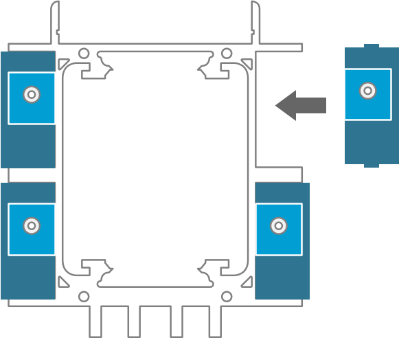

## 4 Fit the servo holders into the frame

The servo holder can be pushed into the frame so that the wires and the servo are locked into place. The small diamond shaped lugs on the servo holders will locate into the holes in the frame and click into place when pushed in.

{:class="img-fluid w-25"}

---
