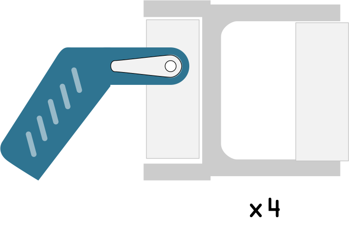

## 10 Mount the foot on the servo holder

Adding the foot to the servo servo holder is simple, make sure the servo can rotate in both directions before you screw in the servo horn. You can check the precise angle of these later using the `test.py` program.

{:class="img-fluid w-25"}

---
