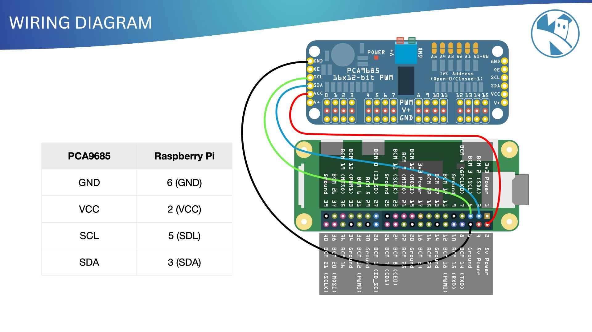

{:class="img-fluid w-100"}

{:class="img-fluid w-100"}

---

## PCA9685 Pinout

PCA9685 Pin | Quad Limb
:----------:|-----------------
     0      | Front Left Leg
     1      | Front Left Foot
     2      | Back Left Leg
     3      | Back Left Foot
     4      | Back Right Leg
     5      | Back Right Foot
     6      | Front Right Leg
     7      | Front Right Foot
{:class="table table-striped "}

---

## PCA9685 to Pi Wiring

PCA9685 | Raspberry Pi
:------:|:-----------:
  GND   |   6 (GND)
  VCC   |   2 (VCC)
  SCL   |   5 (SDL)
  SDA   |   3 (SDA)
{:class="table table-striped "}

---
