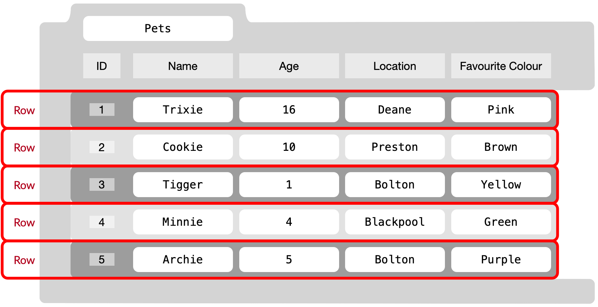

## Overview of Databases

Databases are essential tools for storing, managing, and retrieving data. They play a crucial role in various industries and applications, ranging from small-scale projects to large enterprise systems. In this module, we will explore the fundamentals of databases and their importance.

---

## What is a Database?

A database is like a giant, well-organized digital filing cabinet for information. Imagine you have lots of pieces of information that you need to store and find quickly later - that's what a database is for. It keeps all your data safe and organized, making sure everything stays consistent, doesn't get messed up, and can grow bigger when needed. It's like a superhero for your data, keeping everything under control and easy to manage.

## Importance of Databases

Databases offer several benefits:

- **Data Organization**: Databases help organize data into logical structures, making it easier to manage and retrieve information efficiently.
- **Data Integrity**: Databases enforce data integrity rules, ensuring that data remains consistent and accurate.
- **Data Security**: Databases provide mechanisms to secure sensitive information, controlling access and protecting data from unauthorized users.
- **Data Scalability**: Databases can handle large amounts of data and scale with the growth of an application or organization.
- **Data Consistency**: Databases allow for concurrent access, ensuring that multiple users can work with the data simultaneously while maintaining data consistency.

---

## Introduction to Relational Databases

Relational databases are the most common type of databases used today. They organize data into tables with rows and columns, establishing relationships between tables. Understanding relational databases is crucial for working with databases effectively.

---

## Relational Database Management Systems (RDBMS)

Relational Database Management Systems (RDBMS) are software systems that manage and manipulate relational databases. They provide the tools and interfaces to interact with the underlying database and execute queries to retrieve, modify, and manipulate data.

Popular RDBMS examples include:

- MySQL
- PostgreSQL
- Oracle Database
- SQLite
- Microsoft SQL Server

---

## Introduction to SQLite

`SQLite` is a lightweight and self-contained relational database engine. It is widely used due to its simplicity, portability, and zero-configuration setup. In this section, we will explore the features and use cases of SQLite.

---

## Overview of SQLite

SQLite is a software library that provides a relational database management system. Unlike traditional client-server databases, SQLite operates directly on disk files, making it serverless and ideal for embedded systems, mobile applications, and small-scale projects.

---

## Advantages of Using SQLite

SQLite offers several advantages:

- **Easy to Use**: SQLite is simple to set up and operate, requiring minimal configuration.
- **Self-Contained**: SQLite databases are standalone files, making them portable and easy to manage.
- **Zero-Configuration**: There is no need for separate installations or running database servers. SQLite libraries are included with many programming languages, including Python.
- **Cross-Platform Compatibility**: SQLite is compatible with various operating systems and programming languages.
- **Efficient Performance**: SQLite is highly optimized, providing fast read and write operations.
- **Small Memory Footprint**: SQLite has a small memory footprint and low disk space requirements.

---

## Basic Database Concepts

{:class="img-fluid w-100"}

Before diving into SQLite and Python, it's essential to understand the basic concepts that form the foundation of relational databases. In this section, we will explore tables, records, columns, and primary keys.

---

### Tables: Foundations of a Relational Database

{:class="img-fluid w-100"}

Tables are the fundamental building blocks of a relational database. They consist of rows (also called records or tuples) and columns (also called fields or attributes).

A table represents a specific entity or concept within a database. For example, in a simple library database, we might have a "Books" table to store information about books, with each row representing a specific book and each column representing a piece of information about the book (e.g., title, author, publication year).

---

### Records: Storing and Organizing Data

{:class="img-fluid w-100"}

A record is a complete set of information related to a specific entity in a table. Each record in a table represents a unique occurrence of that entity. For instance, in the "Books" table, each record would correspond to a single book and contain its respective data, such as the book's title, author, and publication year.

To store data in a table, we insert records using SQL INSERT statements. These statements specify the values for each column in the table.

---

### Columns: Data Types and Constraints

{:class="img-fluid w-100"}

Columns represent individual data fields within a table. Each column has a specific data type that defines the kind of data it can store, such as integers, text, dates, or binary data.

Common data types include:

Type | Description | Example
---|---|---
**Integer**| Whole numbers without decimal places| `0`, `1`, `2` ,`3`
**Text**| Alphanumeric characters and strings| `"Robots"`
**Real**| Floating-point numbers| `3.14`
**Date/Time**| Dates and times|`2023-07-14 23:02:01`
**Blob**| Binary large objects, used for storing binary data (e.g., images, files)| `[0x00,0x01,x010]`
{:class="table table-striped"}

Columns can also have constraints that define additional rules for the data they store. Constraints include:

- **NOT NULL**: Specifies that a column must have a value and cannot be empty.
- **UNIQUE**: Ensures that each value in a column is unique across all records.
- **DEFAULT**: Provides a default value for a column if no value is specified during record insertion.
- **PRIMARY KEY**: Identifies a column or set of columns that uniquely identifies each record in the table.

Understanding these concepts is crucial for designing effective database schemas and manipulating data efficiently.

---
