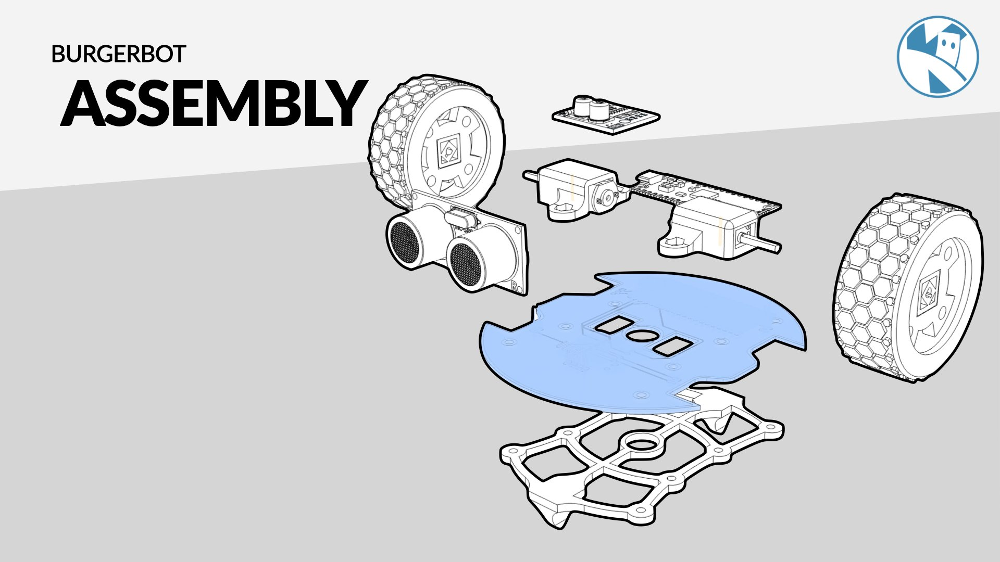

{:class="w-100 card-shadow rounded-3"}

Assembling the BurgerBot only take a couple of minutes.

The first step is to gather all the parts you need. You will need the following:

- 1x BurgerBot custom PCB
- 2x N20 150RPM motors
- 1x battery box
- 1x ultrasonic sensor
- 2x Motor holders
- 2x Wheels
- 1x Raspberry Pi Pico
- 1x Motor driver board (MX1508)

---

## Assembly & Soldering

1. Start by soldering the Raspberry Pi Pico to the custom PCB. The Pico should be soldered to the top side of the PCB, with the USB port facing the USB rectangle.

2. Next, solder the motor driver board to the PCB. The motor driver board should be soldered to the top side of the PCB. Its best to solder the header pins to the PCB, and then drop the motor driver board in place.

3. Solder two wires to each motor, then either solder them directly to the board, or use a header pin and Dupont connector.

4. Solder the ultrasonic sensor to the PCB. The sensor should be soldered to the top side of the PCB, with the sensor facing outwards.

5. The motors will fit neatly into the motor holders, and the wheels will push onto the motor shafts.

6. Screw the motor holders to the top of the base of the robot with M3 screws.

7. The fixed castor will need to be screwed to the bottom of the robot - do this as you attach the screws during step 6.

8. The battery box will need to be connected to the PCB - either directly or via a header pin and Dupont connector. Using a connector can act as a simple power switch.

---

{:class="w-100"}

{:class="w-100"}

{:class="w-100"}

---



---
