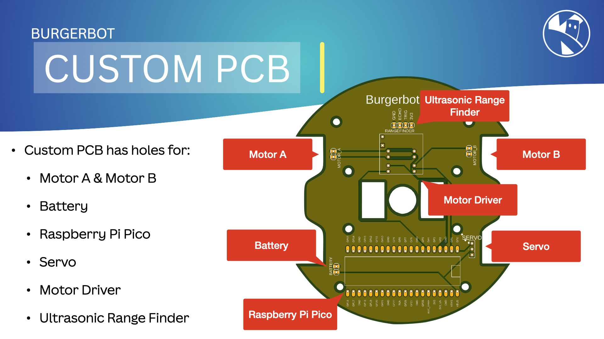

The robot is made up of the following electronic compoenents:

- **Battery** - to power the robot
- **Raspberry pi pico** - to control the robot
- **Motor driver** - to control the DC motors
- **Ultrasonic sensor** - to detect obstacles
- **DC motors** - to drive the robot

The circuit diagram for the robot is shown below:

---
  
{:class="w-100 card-shadow"}

{:class="w-100 card-shadow"}

---



---
