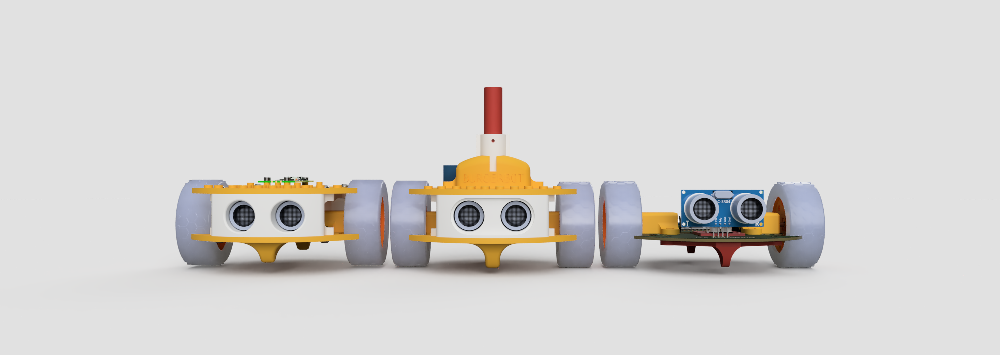

## What is BurgerBot?

BurgerBot is a simple 3d printable robot you can build yourself. It's a flexible design that can be used for a variety of applcations including, simple follow or avoidance, line following, and even drawing with the addition of the pen module.



---

## Evolution of BurgerBot

BurgerBot has evolved over the years, from a simple robot with a Raspberry Pi Pico, to a more complex robot with a Raspberry Pi Pico 2 W and a custom PCB.

{:class="w-100 rounded-3"}

The ltest version of BurgerBot is based on a custom PCB (Printed Circuit Board) that makes it easier to build and more reliable.

For the best results use a Pico H, Pico WH, Pico 2 H, or Pico 2 WH as these have the header pins already soldered in place, and include a small plastic spaceer to keep the PCB off the surface of the robot. This makes it easier to connect a USB cable to the Pico for programming.

{:class="w-100 rounded-3"}

---

## Features

BurgerBot is made up of a base, a front face for the Rangefinder, and a back section that can house the battery pack. The raspberry Pi can either be mounted on top (for the non-drawing version), or inside the robot (for the drawing version).

- 3d printable
- Raspberry Pi Pico powered
- 2x DC motors
- 1x Servo motor (for the drawing version)
- 1x Ultrasonic sensor
- Bluetooth and Wifi connectivity for the Raspberry Pi Pico W & Pico 2 W versions



---



---
